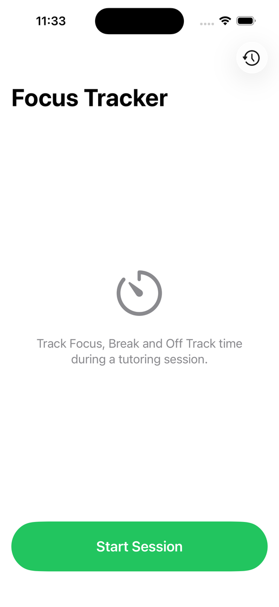
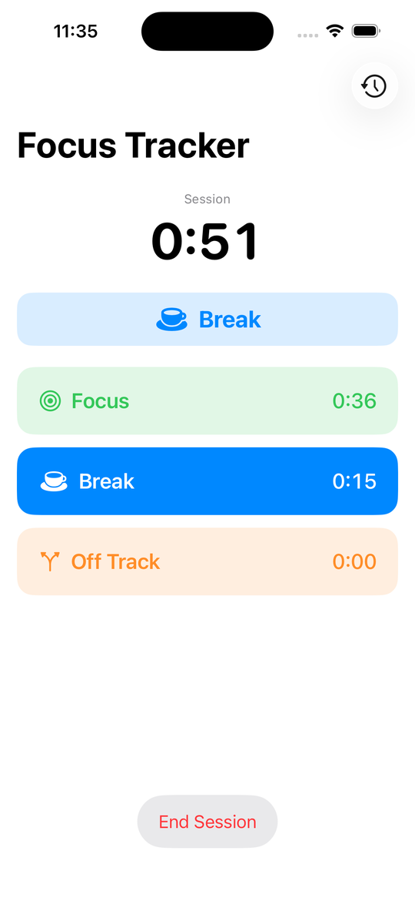
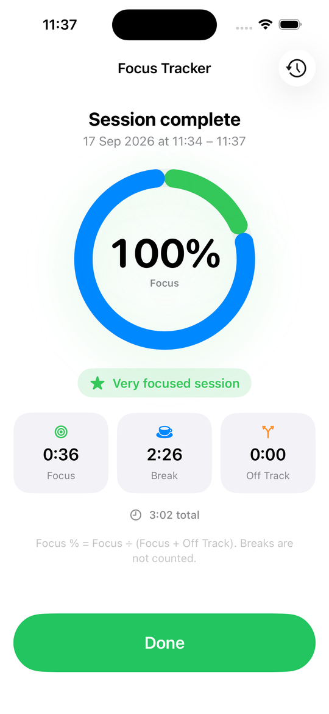
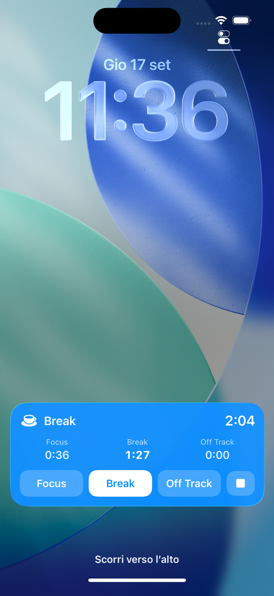

# Focus Tracker

App iOS per misurare quanto di una sessione di studio o tutoring è davvero tempo
di lavoro. Tre stati, **Focus / Break / Off Track**, un tocco per cambiarli, e una
Live Activity interattiva su Lock Screen e Dynamic Island così non serve sbloccare
il telefono. A fine sessione un riepilogo con la percentuale di focus e lo storico.

Nessun backend, nessun account: due file JSON nella cartella Documents dell'app.

Stato: build 2026091602 in TestFlight interno. Pubblicazione sull'App Store in
valutazione.

## Screenshot

| Avvio | Sessione | Riepilogo | Live Activity |
|---|---|---|---|
|  |  |  |  |

## Stack

SwiftUI, iOS 17, `@Observable`. ActivityKit per la Live Activity, AppIntents
(`LiveActivityIntent`) per i pulsanti che cambiano stato dalla Lock Screen,
WidgetKit per l'estensione, `TimelineView` per i contatori. Nessuna dipendenza
esterna.

Focus % = Focus ÷ (Focus + Off Track); le pause non contano.

## Struttura

- `FocusTracker/` app (start, sessione attiva, riepilogo, storico)
- `Shared/` modelli, store, Live Activity manager, App Intents (compilato in entrambi i target)
- `FocusTrackerWidget/` estensione con la Live Activity
- `project.yml` progetto XcodeGen: dopo ogni modifica `xcodegen generate`

Bundle: `com.paolocelestini.focustracker` (widget `.widget`).

## Sviluppo

```bash
xcodebuild -project FocusTracker.xcodeproj -scheme FocusTracker \
  -destination 'platform=iOS Simulator,name=iPhone 16' build
```

I pulsanti della Live Activity richiedono iOS 17 (l'intent viene eseguito nel
processo dell'app).

## Release su TestFlight

1. Bump `MARKETING_VERSION` e `CURRENT_PROJECT_VERSION` in `project.yml`, commit.
2. `scripts/release.sh`: archive Release, upload, attesa esito su App Store Connect,
   gruppo interno.

Prerequisito una tantum: il record app su App Store Connect (`scripts/asc.py app`
dice se manca). La chiave API sta in `~/.appstoreconnect/`, fuori dal repo.
